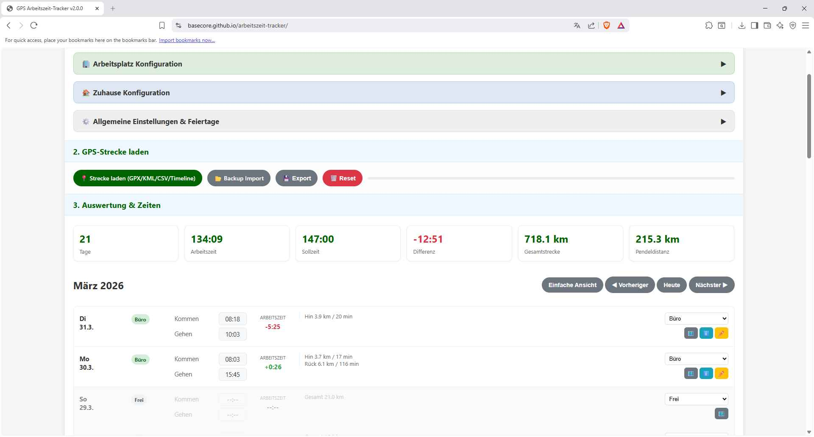
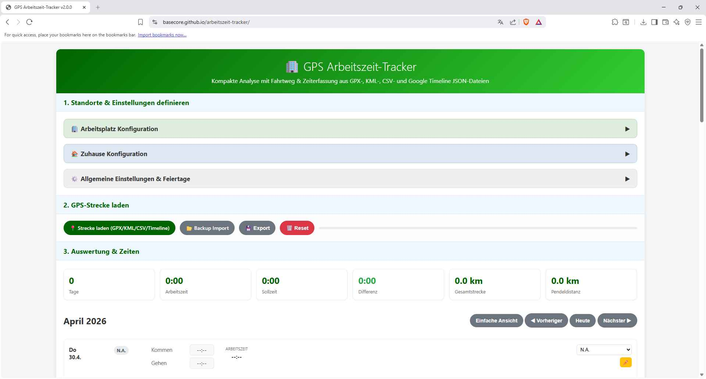
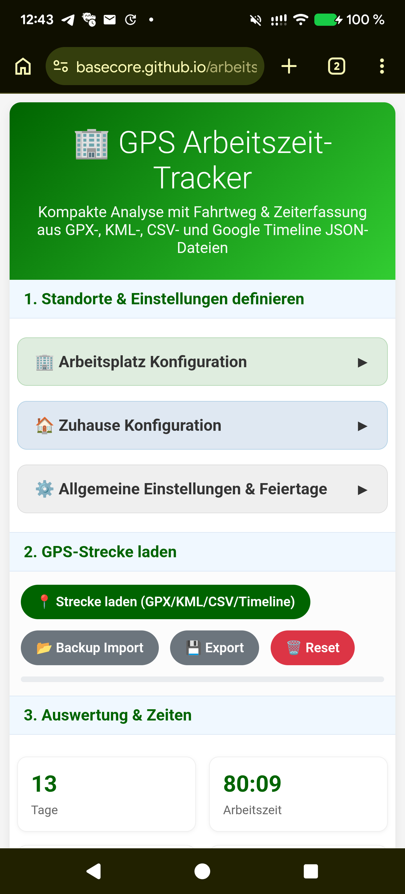
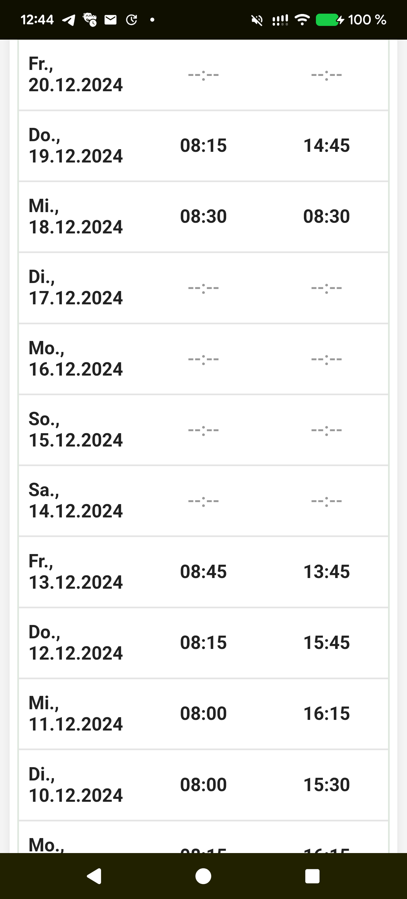
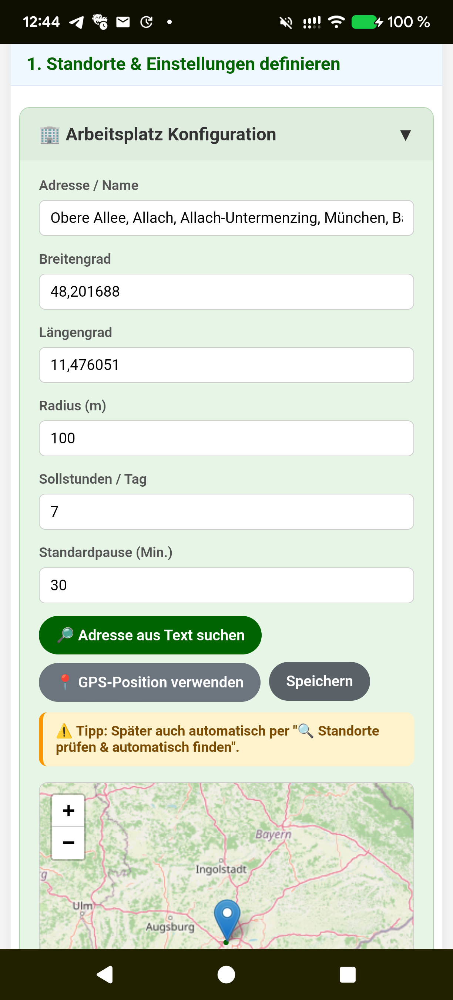

# GPS Arbeitszeit-Tracker & Analysetool

**Smarte Zeiterfassung & Streckenanalyse aus GPX, KML, CSV und JSON**

Eine webbasierte Progressive Web App (PWA) zur lokalen Auswertung von Arbeitszeiten, Aufenthalten am Arbeitsplatz und Fahrtwegen auf Basis von GPS-Tracking-Daten. Die App verarbeitet Dateien direkt im Browser, erkennt Arbeitszeiten anhand definierter Zonen für Zuhause und Arbeitsplatz und visualisiert Tagesrouten auf einer interaktiven Karte.

---

## 🖼️ Vorschau

**Desktop Ansicht** (Übersichtliche GUI & Detailansicht mit interaktiver Karte):

  
  

**Smartphone Ansicht** (Optimierte GUI für mobile Endgeräte):

  
  
  

---

## ✨ Was ist neu? (v2.0.0)

*   **JSON Google Timeline Import:** Direkter Import von JSON-Dateien aus der Google Standortverlauf-Zeitachse.
*   **Kompaktes UI-Design:** Konfigurationsbereiche für Arbeitsplatz, Zuhause und Einstellungen sind standardmäßig eingeklappt – der Fokus liegt sofort auf der Auswertung.
*   **Automatische Neuberechnung:** Bei Änderungen an Zonen oder Standorten fragt das System, ob bestehende Daten sofort mit den neuen Parametern neu berechnet werden sollen.
*   **Smarte Standorthinweise:** Auffällige Erkennung ("🔍 Standorte prüfen & automatisch finden"), wenn hochgeladene Routen nicht zum aktuell konfigurierten Arbeitsplatz passen.
*   **Feiertags-API:** Feiertage können nun noch einfacher direkt per Knopfdruck für das jeweilige Bundesland geladen werden.

---

## 🚀 Hauptfunktionen

### 🔒 100% Lokal & Privat
*   **Lokale Auswertung im Browser:** Keine Cloud, kein Server. Deine sensiblen Standortdaten (`.gpx`, `.kml`, `.csv`, `.json`) verlassen dein Gerät zu keinem Zeitpunkt.
*   **Intelligentes Speichermanagement:** Bei Erreichen des Browser-Speicherlimits werden alte GPS-Routen aufgeräumt, die berechneten Arbeitszeiten bleiben jedoch sicher erhalten.

### 🤖 Smarte Automatisierung
*   **Automatische Standort-Ermittlung:** Du kennst deine exakten Koordinaten nicht? Das Tool lernt aus deinen Routen und schlägt dir Zuhause (Nachts) und Arbeit (Tagsüber) inkl. Adressen vor.
*   **Feiertags-Erkennung:** Das Bundesland wird aus den GPS-Daten gelesen und die passenden Feiertage werden über eine API importiert (manuelle Konfiguration ebenfalls möglich).
*   **Arbeitszeitberechnung:** Automatische Erkennung von Kommen, Gehen, Netto-Arbeitszeit, Pausen, Sollzeit und Über-/Unterstunden.

### 📊 Übersicht & Analyse
*   **Mehrfachimport & Auto-Fokus:** Lade mehrere Dateien gleichzeitig hoch; die App springt automatisch in den aktuellsten Monat.
*   **Pendeldistanz & Gesamtstrecke:** Präzise Anzeige von Hinweg, Rückweg und der gesamten Tagesstrecke.
*   **Interaktive Routenansicht:** Farbliche Aufschlüsselung deiner Route (Hinweg, Rückweg, Aufenthalt am Arbeitsplatz, Pause, Sonstige).
*   **Manuelle Nachbearbeitung:** Kommen/Gehen-Zeiten sowie der Tagesstatus (Büro, Homeoffice, Urlaub, Frei, Feiertag) können pro Tag flexibel überschrieben werden.

---

## 📂 Unterstützte Formate

Für den Streckenimport werden aktuell folgende Dateitypen unterstützt:
*   📍 `.gpx`
*   📍 `.kml` (z. B. aus Google Takeout)
*   📍 `.csv`
*   📍 `.json` (Google Timeline / Standortverlauf)

> 💡 **Tipp:** Du kannst jederzeit eine komplette Sicherung (Konfiguration, Tagesdaten, Routen) als `.json` exportieren und später wiederherstellen.

---

## ⚙️ Einrichtung & Bedienung im Alltag

**Einmalige Konfiguration:**
1. Öffne die Bereiche **" Arbeitsplatz"** und **"🏠 Zuhause"**.
2. Trage deine echten Adressen ein, setze den Punkt auf der Karte oder klicke auf `Standorte automatisch finden` nach deinem ersten Upload.
3. Definiere den Radius (m), deine Sollstunden und die Standardpause.
4. Klicke auf `Speichern`.

**Dein täglicher Workflow:**
1. GPS-Tracking aufzeichnen (z. B. mit *GPSLogger* oder über *Google Maps*).
2. Routen-Datei(en) in die App laden.
3. Daten prüfen, bei Bedarf Zeiten korrigieren oder Status (z. B. Urlaub) anpassen.
4. Fertig! (Regelmäßige JSON-Backups werden empfohlen, da das Löschen der Browserdaten/Caches auch diese Web-App zurücksetzt).

---

## 🧭 Datenquellen & Empfehlungen

<b>Option A: Automatisches Tracking mit GPSLogger (Android)</b>

Für die detaillierte Aufzeichnung eignet sich **GPSLogger** hervorragend: [gpslogger.app](https://gpslogger.app/)

**Empfohlene Konfiguration:**
*   *Neue Datei erstellen:* Monatlich
*   *GPS/GNSS-Standorte aufzeichnen:* Aktiviert
*   *Aufzeichnungsintervall:* 60 Sekunden
*   *Aktualisierungsintervall (passive Standorte):* 1 Sekunde
*   *Genauigkeit:* 40 Meter

<b>Option B: Google Maps Timeline App-Export (JSON)</b>

Da Google die Web-Zeitachse weitgehend eingestellt hat, liegen die Daten lokal auf deinem Smartphone:
1. Öffne die **Google Maps App**.
2. Tippe auf dein Profilbild ➔ **"Deine Zeitachse"**.
3. Öffne das Drei-Punkte-Menü ➔ **"Standort- und Datenschutzeinstellungen"**.
4. Wähle im Bereich *Standorteinstellungen* **"Zeitachsendaten exportieren"**.
5. Speichere die generierte `.json`-Datei und lade sie in den Tracker hoch.

> 💡 *Hinweis:* Für eine ganzheitliche Visualisierung deines Lebens (inkl. Server-Hosting) empfiehlt sich ergänzend das quelloffene Projekt **[Dawarich](https://github.com/Freika/dawarich)**.

<b>Option C: Google Takeout (KML/JSON)</b>

> ⚠️ *Hinweis: Nur noch für Konten verfügbar, deren Zeitachse noch nicht auf Smartphone-only migriert wurde.*

1. Öffne **[Google Takeout](https://takeout.google.com/)**.
2. Wähle **"Auswahl aufheben"** und hake nur **"Zeitachse"** an.
3. Klicke auf **"Dateiformate bearbeiten"** und wähle **KML** oder **JSON**.
4. Erstelle den Export, entpacke die ZIP und lade die Datei hier hoch.

  
  
  

---

## 🛠️ Technischer Hintergrund

*   **Frontend:** Vanilla JavaScript, HTML5, CSS3 (Kein Framework-Overhead)
*   **Maps:** [Leaflet.js](https://leafletjs.com/) mit OpenStreetMap-Tiles
*   **Geocoding:** Nominatim API (OpenStreetMap)
*   **Speicher:** Browser `localStorage` (Offline-First)
*   **Architektur:** Progressive Web App (PWA), installierbar auf Desktop & Mobile

---

  🤖 <i>Dieses Projekt, die Code-Architektur und die Dokumentation wurden mit KI-Unterstützung erstellt, erweitert und optimiert.</i>

